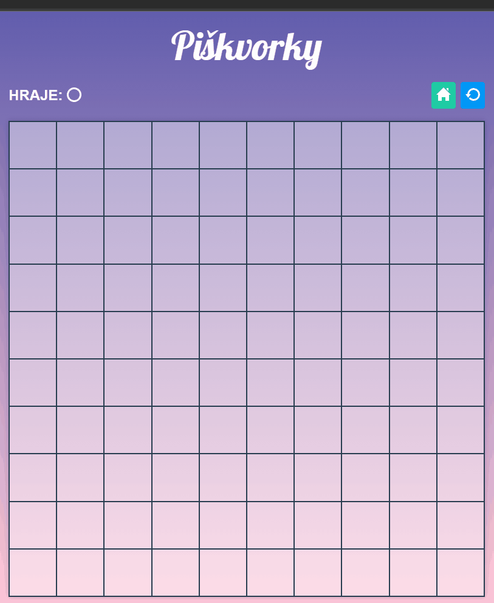

# Úkol: Piškvorky 5/5

Tento úkol navazuje na [Piškvorky 4](https://github.com/Czechitas-podklady-WEB/ukol-piskvorky-4). V tomto závěrečném úkolu necháš za křížek hrát umělou inteligenci.

## Zadání

1. Pokračuj v repozitáři `piskvorky` z předchozích úkolů.

1. Pokud je na tahu křížek, odehraj tah navrhovaný umělou inteligencí z API. Pro kolečko zůstává platit, že za něj hraje uživatel.

   1. Po každém tahu, pokud zatím nikdo nevyhrál, ověř, jestli je na tahu křížek.

   1. Pokud ano, odešli požadavek na API a získej navrhovaný tah. API běží na adrese `https://piskvorky.czechitas-podklady.cz/api/suggest-next-move` a očekává metodu `POST`, hlavičku `Content-type: application/json` a tělo ve formátu JSON. V JSONu musí být objekt s vlastností `board`, kde hodnota je stejné pole, jako ve volání funkce `findWinner` z předchozího úkolu. Objekt dále musí obsahovat vlastnost `player` s hodnotou `'x'` vzhledem k tomu, že chceme návrh tahu pro křížek.

      <details>
      <summary>
      Zde je ukázka získání navrhovaného tahu pro hrací plochu 3x3:
      </summary>

      <!-- prettier-ignore -->
      ```js
      const fields = document.querySelectorAll('.board__field')
      const response = await fetch('https://piskvorky.czechitas-podklady.cz/api/suggest-next-move', {
      	method: 'POST',
      	headers: {
      		'Content-type': 'application/json',
      	},
      	body: JSON.stringify({
      		board: [
      			'x', 'o', 'x',
      			'_', 'x', 'o',
      			'o', 'x', 'o',
      		],
      		player: 'x', // Hledá tah pro křížek.
      	}),
      })
      const data = await response.json()
      const { x, y } = data.position // x bude 0 a y bude 1, protože to je jediné volné políčko. x 0 odpovídá prvnímu sloupci a y 1 druhému řádku.
      const field = fields[x + y * 3] // Najde políčko na příslušné pozici.
      field.click() // Simuluje kliknutí. Spustí událost `click` na políčku.
      ```

      </details>

   1. API ti vrátí souřadnici `x` a `y`. Tu převeď na `index`. Hodnota `x` odpovídá pořadí sloupce začínající nulou a `y` pak pořadí řádku. Pozice na herní ploše 10x10 v levém horním rohu je tedy `{x: 0, y: 0}`, v levém dolním rohu `{x: 0, y: 9}` a v pravém dolním rohu `{x: 9, y: 9}` za předpokladu pořadí políček v HTML podle následujícího obrázku. Pro získání indexu se tím pádem pravděpodobně bude hodit vzoreček `const index = x + y * 10`.

      

   1. Na DOM elementu příslušného políčka zavolej metodu `.click()`. Tu prohlížeč pochopí podobně jako by uživatel na políčko klikl myší. Vyvolá se tak událost `click`, na kterou posloucháš díky předchozím úkolům.

   1. Ověř si, že po každém tahu uživatele (kolečko) se po chvilce objeví i tah umělé inteligence (křížek).

      

### Bonus

- Dotaz na API nějakou dobu trvá. Zařiď, aby během čekání na umělou inteligenci nemohl uživatel klikat na další políčka.

  1.  Před odstartováním funkce `fetch` nastav všem políčkům `disabled` na `true`.

  1.  Po získání odpovědi nastav všem políčkům zpět `disabled` na `false`. Pouze ale těm, na kterých není ani křížek ani kolečko.
